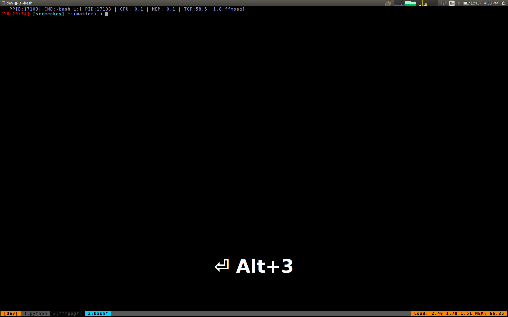
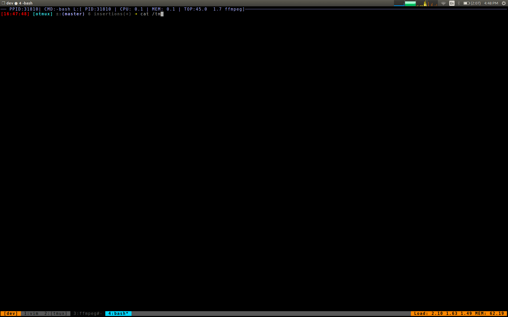

# otmux

Perform multiple remote activities using tmux


## Installation

#### To install from release (Built on linux)

```bash
sudo su
curl -L https://github.com/rda3mon/otmux/releases/download/v0.1-pre/otmux -o /usr/local/bin/otmux
chmod +x /usr/local/bin/otmux
```

#### To install from source

For latest release

```bash
git clone https://github.com/rda3mon/otmux.git /tmp/otmux && cd /tmp/otmux
make && sudo make install
```

For specific release

```bash
git clone https://github.com/rda3mon/otmux.git --branch v0.1-pre /tmp/otmux && cd /tmp/otmux
make && sudo make install
```

#### Features

* SSH into multiple remote instances using tmux. Similar to [cssh](https://linux.die.net/man/1/cssh) command with lot more capability and run commands parallelly or independently.



* SSH into single remote instances multiple number of times using tmux. This can be useful at times where you want to tail log on one of the connection and restart service on another connection 



## Usage

```bash
usage: otmux [-h] (-m HOSTS | -H HOSTSFILE) (-r | -l) [-p PSIZE] [-c COUNT] -s
             SESSION [-i {all,first,last,any}] [-d]

Multi remote actions using Tmux and ssh

optional arguments:
  -h, --help            show this help message and exit
  -m HOSTS, --hosts HOSTS
                        hosts, space seperated
  -H HOSTSFILE, --hostsfile HOSTSFILE
                        host file, line seperated
  -r, --remote          should you perform operations remotely
  -l, --login           should you login into each of the hosts
  -p PSIZE, --psize PSIZE
                        number of sessions per window. Default=9
  -c COUNT, --count COUNT
                        number of sessions per instance. Default=1
  -s SESSION, --session SESSION
                        session name
  -i {all,first,last,any}, --instances {all,first,last,any}
                        instance to login
  -d, --dry             Dry run
```
